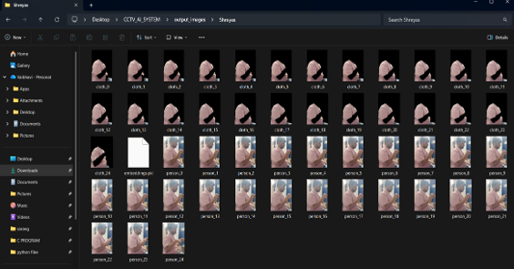
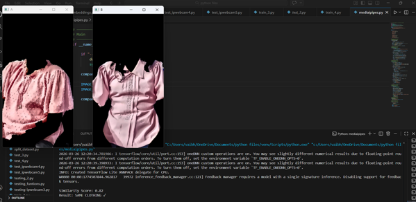
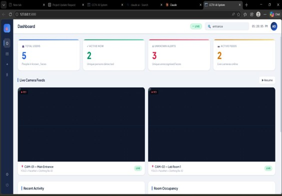
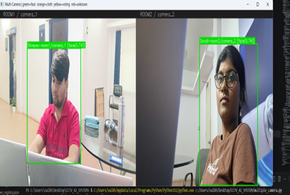
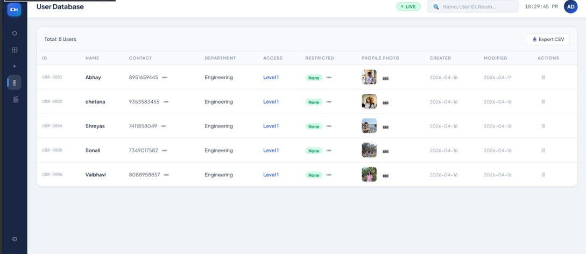
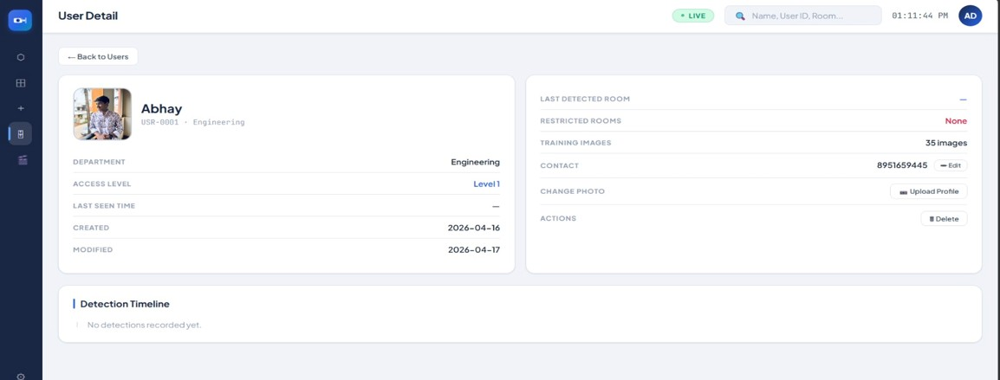
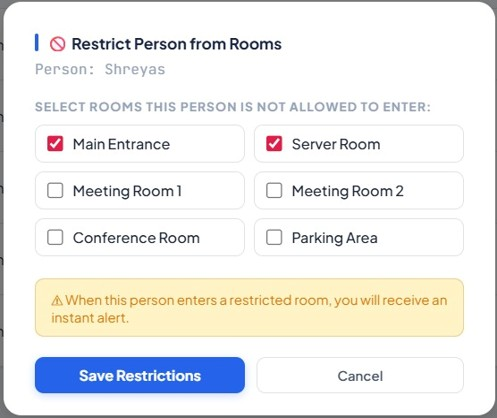
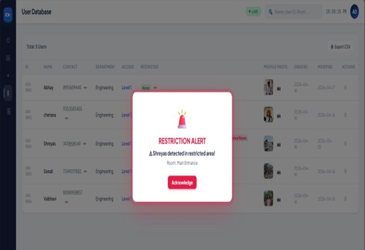

# AI Powered Multi-Camera Surveillance System

An AI-powered surveillance system that performs **real-time person detection, face recognition, and person re-identification** across multiple camera feeds. The system leverages deep learning and computer vision techniques to enhance surveillance by identifying individuals, tracking them across cameras, and providing an intuitive graphical interface for monitoring.

---

## 📌 Overview

Traditional surveillance systems require continuous human monitoring, making them inefficient for large-scale environments. This project introduces an AI-based surveillance solution capable of automatically detecting people, recognizing registered individuals, and tracking them across multiple camera streams.

The system combines object detection, face recognition, and person re-identification techniques to improve surveillance accuracy while reducing manual effort.

---

## ✨ Features

- 👤 Real-time person detection using YOLO
- 😊 Face detection using YuNet
- 🧠 Face recognition using FaceNet embeddings
- 🎯 Multi-camera person tracking
- 👕 Clothing-based person re-identification
- 💾 Face embedding database for registered users
- 📷 Real-time surveillance dashboard (GUI)
- ⚡ Fast and efficient detection pipeline

---

## 🛠️ Technologies Used

- Python
- OpenCV
- YOLO
- YuNet Face Detector
- FaceNet
- NumPy
- SQLite
- Tkinter (GUI)

---

## 📂 System Workflow

1. Capture video from multiple cameras.
2. Detect people using YOLO.
3. Detect faces using YuNet.
4. Preprocess detected faces.
5. Generate face embeddings using FaceNet.
6. Compare embeddings with the registered database.
7. Identify known individuals.
8. Perform clothing-based person re-identification.
9. Display results in the graphical user interface.

---

## 🚀 Key Modules

### Person Detection
Detects all people in the video stream using the YOLO object detection model.

### Face Detection
Uses YuNet to accurately detect faces in real-time.

### Face Recognition
Generates face embeddings using FaceNet and matches them against stored embeddings.

### Person Re-Identification
Tracks individuals across multiple camera views using clothing appearance when facial information is unavailable.

### GUI Dashboard
Displays live video streams, detected faces, recognized identities, and surveillance status.

---

## 📊 Results

The developed system successfully:

- Detected people in real-time
- Recognized registered users accurately
- Tracked individuals across multiple cameras
- Performed reliable face recognition using FaceNet
- Improved surveillance efficiency with an interactive GUI

---

## 📸 Output

<table align="center">
  <tr>
    <td align="center">
       
      <b>Home Screen</b>
    </td>
    <td align="center">
       
      <b>Person Detection</b>
    </td>
  </tr>
</table>

<table align="center">
  <tr>
    <td align="center">
       
      <b>Face Detection using YuNet</b>
    </td>
    <td align="center">
       
      <b>Face Recognition using FaceNet</b>
    </td>
  </tr>
</table>

<table align="center">
  <tr>
    <td align="center">
       
      <b>Clothing Based Re-identification</b>
    </td>
    <td align="center">
       
      <b>Clothing Based Re-identification</b>
    </td>
  </tr>
</table>

<table align="center">
  <tr>
    <td align="center">
       
      <b>Live Webcam Feed</b>
    </td>
    <td align="center">
       
      <b>Cameras</b>
    </td>
  </tr>
</table>

<table align="center">
  <tr>
    <td align="center">
       
      <b>User Database</b>
    </td>
    <td align="center">
       
      <b>User Details</b></b>
    </td>
  </tr>
</table>

## 📸 Adding New User

<table align="center">
  <tr>
    <td align="center">
       
      <b>Restrictions</b>
    </td>
    <td align="center">
       
      <b>Restrictions Alert</b></b>
    </td>
  </tr>
</table>

## 🔮 Future Enhancements

- Cloud-based surveillance
- Mobile application integration
- Face mask recognition
- Suspicious activity detection
- Crowd analytics
- Automatic alert generation
- Edge AI deployment
- CCTV network integration

---

## 👩‍💻 Author

**Vaibhavi Patil**

Bachelor of Engineering (Electronics & Communication Engineering)

KLE Technological University

---
